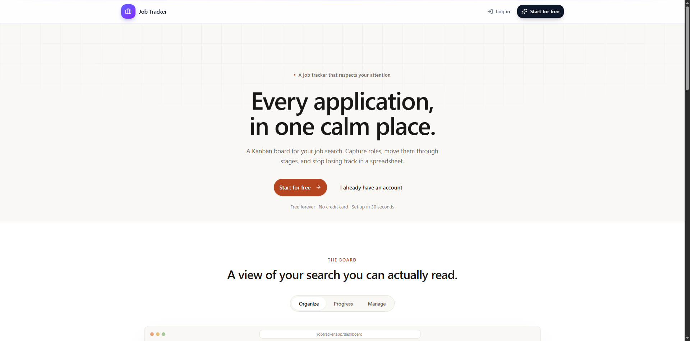

<div align="center">

# 🎯 Job Application Tracker


**A beautiful Kanban board for organizing your job search.**

Track every application from *Wish List* to *Offer* — drag, drop, and never lose track again.

[](https://nextjs.org/)
[](https://react.dev/)
[](https://www.typescriptlang.org/)
[](https://www.mongodb.com/)
[](https://tailwindcss.com/)
[](https://vercel.com/)

[Live Demo](https://your-project.vercel.app) · [Report Bug](../../issues) · [Request Feature](../../issues)

</div>

---

## 📖 Table of Contents

- [About the Project](#-about-the-project)
- [Features](#-features)
- [Tech Stack](#-tech-stack)
- [Project Structure](#-project-structure)
- [Getting Started](#-getting-started)
- [Environment Variables](#-environment-variables)
- [Seeding the Database](#-seeding-the-database)
- [Deployment](#-deployment)
  - [Deploy to Vercel](#deploy-to-vercel)
  - [MongoDB Atlas Setup](#mongodb-atlas-setup)
- [Architecture Deep Dive](#-architecture-deep-dive)
- [Available Scripts](#-available-scripts)
- [Key Learnings](#-key-learnings)
- [Roadmap](#-roadmap)
- [License](#-license)

---

## 🚀 About the Project

**Job Application Tracker** is a full-stack web application that helps job seekers visualize and manage their job hunt. Instead of juggling spreadsheets, sticky notes, and emails, you get a clean **Kanban board** where every application is a draggable card.

Move a card → the status updates. Edit a card → the changes save instantly. Everything is real-time, optimistic, and persistent across sessions.

Built with the latest **Next.js 16 App Router**, **React 19**, **Server Actions**, and **MongoDB** — this project demonstrates a modern, production-ready architecture without a single traditional API route.

---

## ✨ Features

| Feature | Description |
|---|---|
| 🔐 **Email/Password Auth** | Secure authentication via Better Auth with cookie-based sessions |
| 🎨 **Kanban Board** | 5 default columns: Wish List, Applied, Interviewing, Offer, Rejected |
| 🖱️ **Drag & Drop** | Smooth card reordering with `dnd-kit` — within and across columns |
| ⚡ **Optimistic UI** | Instant feedback on every action, with automatic rollback on failure |
| 🧠 **Smart Caching** | Server-side caching with `use cache` + on-demand `revalidateTag` |
| 🏗️ **Server Actions** | Type-safe mutations — no API routes needed |
| 📱 **Responsive Design** | Works on desktop, tablet, and mobile |
| 🎯 **Auto Board Creation** | Every new user gets a pre-configured board via database hooks |
| 🌱 **Seed Script** | Batch-insert sample jobs for quick testing |
| 🎨 **Modern UI** | Radix UI primitives + Tailwind CSS 4 + Lucide icons |
| 🔒 **Ownership Verification** | Every mutation verifies the user owns the resource |
| 🔄 **Reorder Reindexing** | Positions stored as gaps of 100, reindexed on every move |

---

## 🛠️ Tech Stack

### Core
- **Framework**: [Next.js 16](https://nextjs.org/) (App Router, Turbopack)
- **Language**: [TypeScript 5](https://www.typescriptlang.org/)
- **UI Library**: [React 19](https://react.dev/)
- **Styling**: [Tailwind CSS 4](https://tailwindcss.com/)

### Backend
- **Database**: [MongoDB](https://www.mongodb.com/) with [Mongoose 9](https://mongoosejs.com/)
- **Auth**: [Better Auth](https://www.better-auth.com/)
- **Mutations**: [Next.js Server Actions](https://nextjs.org/docs/app/building-your-application/data-fetching/server-actions-and-mutations)

### Frontend
- **Drag & Drop**: [@dnd-kit](https://dndkit.com/)
- **UI Primitives**: [Radix UI](https://www.radix-ui.com/)
- **Icons**: [Lucide React](https://lucide.dev/)
- **Utilities**: `clsx`, `tailwind-merge`, `class-variance-authority`

### Tooling
- **Linting**: ESLint 9 + `eslint-config-next`
- **Runtime**: Node.js 20.19+
- **Package Manager**: npm
- **Deployment**: Vercel + MongoDB Atlas

---

## 📁 Project Structure

```
job-application-tracker/
├── 📁 app/                              # Next.js App Router
│   ├── 📁 api/
│   │   └── 📁 auth/
│   │       └── 📁 [...all]/
│   │           └── 📄 route.ts          # Better Auth catch-all handler
│   ├── 📁 dashboard/
│   │   └── 📄 page.tsx                  # Main dashboard (Server Component)
│   ├── 📁 sign-in/
│   │   └── 📄 page.tsx                  # Sign-in form
│   ├── 📁 sign-up/
│   │   └── 📄 page.tsx                  # Sign-up form
│   ├── 📄 favicon.ico
│   ├── 🎨 globals.css                   # Tailwind + theme variables
│   ├── 📄 layout.tsx                    # Root layout
│   └── 📄 page.tsx                      # Landing page
│
├── 📁 components/                       # React components
│   ├── 📁 ui/                           # shadcn/ui primitives
│   │   ├── 📄 avatar.tsx
│   │   ├── 📄 button.tsx
│   │   ├── 📄 card.tsx
│   │   ├── 📄 dialog.tsx
│   │   ├── 📄 dropdown-menu.tsx
│   │   ├── 📄 input.tsx
│   │   ├── 📄 label.tsx
│   │   └── 📄 textarea.tsx
│   ├── 📄 create-job-dialog.tsx         # Modal to add a new application
│   ├── 📄 image-tabs.tsx                # Landing page hero tabs
│   ├── 📄 job-application-card.tsx      # Individual job card (draggable)
│   ├── 📄 kanban-board.tsx              # Main Kanban board
│   ├── 📄 navbar.tsx                    # Top navigation bar
│   └── 📄 sign-out-btn.tsx              # Sign-out dropdown item
│
├── 📁 lib/                              # Core logic
│   ├── 📁 actions/
│   │   └── 📄 job-applications.ts       # Server Actions (create/update/delete)
│   ├── 📁 auth/
│   │   ├── 📄 auth-client.ts            # Browser-side auth client
│   │   └── 📄 auth.ts                   # Server-side Better Auth config
│   ├── 📁 hooks/
│   │   └── 📄 useBoards.ts              # Client-side board state + optimistic moves
│   ├── 📁 models/                       # Mongoose schemas
│   │   ├── 📄 board.ts                  # Board model
│   │   ├── 📄 column.ts                 # Column model
│   │   ├── 📄 index.ts                  # Model exports
│   │   ├── 📄 job-application.ts        # JobApplication model
│   │   └── 📄 models.types.ts           # Shared TypeScript types
│   ├── 📄 db.ts                         # Cached MongoDB connection
│   ├── 📄 init-user-board.ts            # Auto-create board on signup
│   └── 📄 utils.ts                      # cn() + serialize() helpers
│
├── 📁 public/
│   ├── 📁 hero-images/
│   │   ├── 🖼️ hero1.png
│   │   ├── 🖼️ hero2.png
│   │   └── 🖼️ hero3.png
│   ├── 🖼️ file.svg
│   ├── 🖼️ globe.svg
│   ├── 🖼️ next.svg
│   ├── 🖼️ vercel.svg
│   └── 🖼️ window.svg
│
├── 📁 scripts/
│   └── 📄 seed.ts                       # Batch-insert 35 sample jobs
│
├── ⚙️ .gitignore
├── 📝 README.md
├── ⚙️ components.json                   # shadcn/ui config
├── 📄 eslint.config.mjs
├── 📄 middleware.ts                     # Auth route guards
├── 📄 next.config.ts
├── ⚙️ package-lock.json
├── ⚙️ package.json
├── 📄 postcss.config.mjs
└── ⚙️ tsconfig.json
```

---

## 🏁 Getting Started

### Prerequisites

Before you begin, make sure you have:

- **Node.js** `20.19+` — [Download](https://nodejs.org/)
- **MongoDB** database — [Atlas (cloud)](https://www.mongodb.com/cloud/atlas) or local
- **Git** installed
- A terminal (bash, zsh, or PowerShell)

### Installation

**1. Clone the repository**

```bash
git clone https://github.com/zobbygit/Job_Track_Website
cd job-application-tracker
```

**2. Install dependencies**

```bash
npm install
```

**3. Set up environment variables**

Create a `.env.local` file in the project root (see [Environment Variables](#-environment-variables) below):

```bash
touch .env.local
```

Paste this template inside:

```env
# ─── Database ─────────────────────────────────────────
MONGODB_URI=mongodb+srv://<user>:<pass>@<cluster>.mongodb.net/job-tracker

# ─── Better Auth (server-side) ────────────────────────
BETTER_AUTH_SECRET=<generate with: openssl rand -base64 32>
BETTER_AUTH_URL=http://localhost:3000

# ─── Better Auth (client-side) ────────────────────────
NEXT_PUBLIC_BETTER_AUTH_URL=http://localhost:3000

# ─── Seed Script (optional) ───────────────────────────
SEED_USER_ID=<your-mongodb-user-_id>
```

**Generate the auth secret:**

```bash
openssl rand -base64 32
```

**4. Start the development server**

```bash
npm run dev
```

**5. Open [http://localhost:3000](http://localhost:3000)**

Sign up with any email/password → your board is auto-created → start adding jobs.

---

## 🔐 Environment Variables

| Variable | Scope | Required | Description |
|---|---|---|---|
| `MONGODB_URI` | Server | ✅ | MongoDB Atlas or local connection string |
| `BETTER_AUTH_SECRET` | Server | ✅ | Random string used to sign session cookies |
| `BETTER_AUTH_URL` | Server | ✅ | Full URL of your app (used for redirects) |
| `NEXT_PUBLIC_BETTER_AUTH_URL` | Client | ✅ | Same value as `BETTER_AUTH_URL`, exposed to the browser |
| `SEED_USER_ID` | Script | ⚠️ Optional | Your MongoDB `user._id` for running the seed script |

### 🔑 Generating `BETTER_AUTH_SECRET`

```bash
# Any of these works:
openssl rand -base64 32
openssl rand -hex 32
node -e "console.log(require('crypto').randomBytes(32).toString('hex'))"
```

⚠️ **Use a different secret for production.** Never commit secrets to Git.

---

## 🌱 Seeding the Database

The project includes a seed script that batch-inserts **35 sample job applications** across the default columns — perfect for testing the UI.

### Step 1: Find Your User ID

Sign up in the app first, then open MongoDB Atlas → browse `user` collection → copy the `_id` of your user.

### Step 2: Add to `.env.local`

```env
SEED_USER_ID=6929e34361b6f083d154859d
```

### Step 3: Run the Seed

```bash
npm run seed:jobs
```

**Expected output:**

```
🌱 Starting seed process...
📋 Seeding data for user ID: 6929e3...
✅ Connected to database
✅ Board found
✅ Found 5 columns
🗑️  Deleting 15 existing job applications...
🎉 Seed completed successfully!
📊 Created 35 job applications
📋 Board: Job Hunt
👤 User ID: 6929e3...
```

Refresh the dashboard → 35 cards spread across 5 columns.

---

## ☁️ Deployment

### Deploy to Vercel

#### 1. Push to GitHub

```bash
git add .
git commit -m "Ready for deployment"
git push origin main
```

#### 2. Import on Vercel

1. Go to [vercel.com/new](https://vercel.com/new)
2. Import your GitHub repository
3. Vercel auto-detects **Framework: Next.js** — leave it
4. **Do not** click Deploy yet — add environment variables first

#### 3. Add Environment Variables

In **Project Settings → Environment Variables**, add all four (for **Production, Preview, and Development**):

| Name | Value |
|---|---|
| `MONGODB_URI` | Your Atlas connection string |
| `BETTER_AUTH_SECRET` | A **new** secret (different from local) |
| `BETTER_AUTH_URL` | `https://your-project.vercel.app` |
| `NEXT_PUBLIC_BETTER_AUTH_URL` | Same as above |

> 💡 **Pro tip:** Reserve a clean project name like `job-tracker` so Vercel assigns `https://job-tracker.vercel.app` instead of a random URL.

#### 4. Deploy

Click **Deploy**. Wait for the build to complete.

#### 5. Update URLs After First Deploy

Vercel gives you a production URL after the first build. If it differs from what you set:

1. Go to **Settings → Environment Variables**
2. Update `BETTER_AUTH_URL` and `NEXT_PUBLIC_BETTER_AUTH_URL`
3. **Redeploy** (Deployments → ⋯ → Redeploy)

---

### MongoDB Atlas Setup

Vercel deployments use **dynamic IPs** — you must allow them to connect.

1. Log in to [MongoDB Atlas](https://cloud.mongodb.com/)
2. Navigate to your project → **Network Access**
3. Click **Add IP Address**
4. Select **Allow Access From Anywhere** → CIDR: `0.0.0.0/0`
5. Click **Confirm**

> ⚠️ Your DB is still protected by username + password. `0.0.0.0/0` only opens network access.

**Alternatively**, use a Vercel integration for private networking (more secure, but requires a paid Atlas tier).

---

### Vercel Build Troubleshooting

| Error | Cause | Fix |
|---|---|---|
| `SIGKILL` / OOM | Turbopack memory with `cacheComponents` | Add `NODE_OPTIONS=--max-old-space-size=4096` env var |
| `Failed to connect to MongoDB` | IP whitelist missing `0.0.0.0/0` | Recheck Step 3 above |
| Session lost on every request | Missing `BETTER_AUTH_SECRET` | Set it — Vercel serverless instances need a shared secret |
| Auth redirect loop | `BETTER_AUTH_URL` still `localhost` | Update to production URL, redeploy |
| Build fails on `scripts/seed.ts` | `next build` type-checks every `.ts` file | Add `"scripts"` to `tsconfig.json` `exclude` array |

---

## 🏗️ Architecture Deep Dive

### Database Schema

```
┌───────────────────┐
│      Board        │   One per user, named "Job Hunt"
│  ─────────────    │
│  _id              │
│  userId (String)  │   ◀── Better Auth user ID
│  name             │
│  columns: [ObjId] │ ───┐
└───────────────────┘    │
                         ▼
                 ┌───────────────────┐
                 │      Column       │   5 per board
                 │  ─────────────    │
                 │  _id              │
                 │  name             │
                 │  order (Number)   │
                 │  boardId (ObjId)  │
                 │  jobApplications  │ ───┐
                 │    [ObjId]        │    │
                 └───────────────────┘    │
                                          ▼
                                  ┌───────────────────┐
                                  │  JobApplication   │   N per column
                                  │  ─────────────    │
                                  │  _id              │
                                  │  company          │
                                  │  position         │
                                  │  location         │
                                  │  salary           │
                                  │  jobUrl           │
                                  │  tags: [String]   │
                                  │  description      │
                                  │  notes            │
                                  │  order (Number)   │   ◀── multiples of 100
                                  │  columnId (ObjId) │
                                  │  boardId (ObjId)  │
                                  │  userId (String)  │
                                  └───────────────────┘
```

### Ordering Strategy — Why Multiples of 100?

Instead of storing order as `0, 1, 2, 3...`, we use `0, 100, 200, 300...`.

**Why?** When inserting between two jobs at order `100` and `200`, we can use `150` — no need to shift neighbors. Only full reindexes (which we already do) will normalize the gaps back to `100`-spacing.

The server action `reindexColumn()` runs after every mutation, so the `× 100` spacing is always guaranteed after a successful write.

### Server Actions vs API Routes

Traditional Next.js uses `app/api/*/route.ts` files. This project uses **Server Actions** instead:

```ts
// lib/actions/job-applications.ts
"use server";

export async function createJobApplication(data: JobApplicationData) {
  // runs on the server, called directly from client components
}
```

**Benefits:**
- ✅ End-to-end type safety (client and server share types)
- ✅ No serialization boilerplate
- ✅ Built-in CSRF protection
- ✅ Automatic revalidation via `revalidatePath` / `revalidateTag`

### Cache Invalidation Flow

```
User drags card
      ▼
Client (optimistic update)
      ▼
Server Action runs updateJobApplication()
      ▼
MongoDB updated
      ▼
revalidateTag(`board-${userId}`)  ← invalidates cached board
      ▼
Next.js re-fetches fresh board data
      ▼
Client receives new props (React reconciles)
```

### Authentication Flow

1. User submits `sign-up` form
2. Better Auth validates credentials
3. **`databaseHooks.user.create.after`** hook fires
4. `initializeUserBoard(user.id)` creates a board + 5 columns
5. Session cookie set (`better-auth.session_token`)
6. Redirect to `/dashboard`

`middleware.ts` runs on every request to `/dashboard`, `/sign-in`, `/sign-up`:
- Logged-in + auth page → redirect to `/dashboard`
- Not logged-in + dashboard → redirect to `/sign-in`

---

## 📜 Available Scripts

| Script | Command | Description |
|---|---|---|
| `dev` | `npm run dev` | Start dev server on port 3000 |
| `build` | `npm run build` | Build for production |
| `start` | `npm run start` | Start production server |
| `lint` | `npm run lint` | Run ESLint |
| `seed:jobs` | `npm run seed:jobs` | Seed database with 35 sample jobs |

---

## 🎓 Key Learnings

This project demonstrates several modern patterns worth studying:

### 1. Server Components vs Client Components
- `app/dashboard/page.tsx` → **Server Component** (fetches data, no interactivity)
- `components/kanban-board.tsx` → **Client Component** (`"use client"`, handles drag/drop)

### 2. Server Actions for Mutations
No API routes. Every mutation is a `"use server"` function that the client imports directly.

### 3. Optimistic UI with Rollback
`lib/hooks/useBoards.ts` updates local state **before** the server responds, then rolls back if the server errors.

### 4. Cross-Boundary Serialization
Mongoose returns `ObjectId` instances. Next.js refuses to send objects with `toJSON()` methods across the Server → Client boundary. Solution: a `serialize()` helper that does `JSON.parse(JSON.stringify(x))`.

### 5. Cache Tags for Surgical Invalidation
Instead of `revalidatePath("/dashboard")` (which invalidates *all* users' boards), we use `revalidateTag(\`board-${userId}\`)` to invalidate just one user.

### 6. Deterministic IDs for Hydration
`dnd-kit`'s `DndContext` uses an internal ID counter that differs between server and client, causing hydration errors. Fix: pass an `id` prop based on the board's `_id`.

### 7. Radix `asChild` Pattern
Wrapping `<Button>` inside `<DialogTrigger>` produces nested `<button>` elements. Using `asChild` merges Radix's props onto the Button instead of nesting.

### 8. Batch Inserts for Performance
The seed script uses `JobApplication.insertMany()` instead of a loop of `.create()` calls — one round trip instead of N.

---

## 🗺️ Roadmap

- [x] Email/password authentication
- [x] Kanban board with drag & drop
- [x] Auto board creation on signup
- [x] Optimistic UI with rollback
- [x] Cache tagging for surgical invalidation
- [x] Batch seeding script
- [ ] Job application status history
- [ ] Search and filtering
- [ ] Email notifications on status changes
- [ ] Multiple boards per user
- [ ] File attachments (resumes, cover letters)
- [ ] Analytics dashboard (application funnel metrics)
- [ ] Dark mode toggle
- [ ] Keyboard shortcuts

---

## 🤝 Contributing

Contributions are welcome! To contribute:

1. Fork the repository
2. Create a feature branch: `git checkout -b feature/amazing-feature`
3. Commit your changes: `git commit -m 'Add amazing feature'`
4. Push: `git push origin feature/amazing-feature`
5. Open a Pull Request

---

## 📄 License

This project is created for **educational purposes** as part of a YouTube tutorial series. Feel free to use it as a learning resource or starting point for your own projects.

---

<div align="center">

**Built with ❤️ using Next.js 16, React 19, and MongoDB**

⭐ **If you found this helpful, give it a star!** ⭐

</div>